# 第1章 邻近服务

在本章中，我们设计一个附近地点服务。附近地点服务用于发现附近的餐厅、酒店、剧院、博物馆等场所，是一个核心组件，为 Yelp 上查找附近最佳餐厅或 Google 地图上查找最近加油站等功能提供支持。图 1.1 展示了 Yelp [1] 上用于搜索附近餐厅的用户界面。请注意本书中使用的地图瓦片来自 Stamen Design [2]，数据来自 OpenStreetMap [3]。  
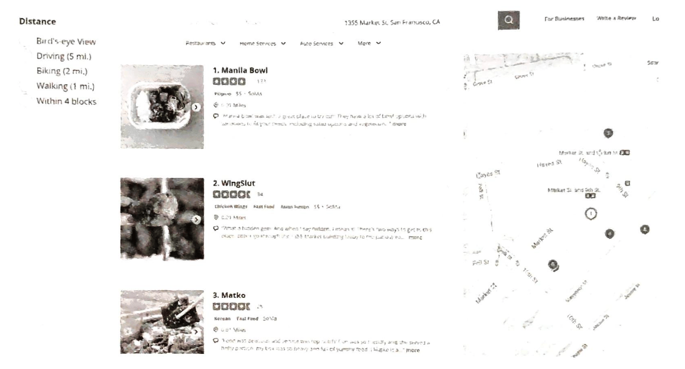  
图 1.1: Yelp上的附近搜索

## 第1步 - 理解问题并确定设计范围
Yelp 支持很多功能，在面试过程中不可能设计所有功能，所以通过提问来缩小范围很重要。面试官和候选人之间的对话可能是这样的:

候选人: 用户能否指定搜索半径？如果在搜索半径内没有足够的商家，系统是否会扩大搜索范围？

面试官: 这是个很好的问题。让我们假设我们只关心指定半径内的商家。如果时间允许，我们可以讨论在半径内没有足够商家时如何扩大搜索范围。

候选人: 允许的最大半径是多少？我可以假设是20公里(12.5英里)吗？

面试官: 这是一个合理的假设。

候选人: 用户能否在UI上更改搜索半径？

面试官: 是的，我们有以下选项:0.5公里(0.31英里)、1公里(0.62英里)、2公里(1.24英里)、5公里(3.1英里)和20公里(12.42英里)。

候选人: 商家信息如何添加、删除或更新？我们需要实时反映这些操作吗？

面试官: 商家所有者可以添加、删除或更新商家。假设我们有一个预先的业务协议，新添加/更新的商家将在第二天生效。

候选人: 用户在使用应用/网站时可能在移动，所以一段时间后搜索结果可能会略有不同。我们需要不断刷新页面以保持结果最新吗？

面试官: 让我们假设用户的移动速度很慢，我们不需要持续刷新页面。

### 功能需求
基于这次对话，我们专注于3个关键功能:
- 基于用户位置(经纬度对)和半径返回所有商家。
- 商家所有者可以添加、删除或更新商家，但这些信息不需要实时反映。
- 客户可以查看商家的详细信息。

### 非功能需求
从业务需求中，我们可以推断出一系列非功能需求。你也应该与面试官确认这些需求。

- 低延迟。用户应该能够快速看到附近的商家。
- 数据隐私。位置信息是敏感数据。当我们设计基于位置的服务(LBS)时，应该始终考虑用户隐私。我们需要遵守数据隐私法律，如通用数据保护条例(GDPR)[4]和加州消费者隐私法案(CCPA)[5]等。
- 高可用性和可扩展性要求。我们应该确保系统能够处理人口密集区域高峰时段的流量激增。

### 粗略估算
让我们看一下一些粗略计算，以确定我们的解决方案需要应对的潜在规模和挑战。假设我们有1亿日活跃用户和2亿商家。

计算QPS
一天的秒数 = 24×60×60 = 86,400。我们可以将其四舍五入到10^5以便计算。10^5在本书中用来表示一天的秒数。
- 假设一个用户每天进行5次搜索查询。
- 搜索QPS = 1亿×5/10^5 = 5,000

## 第2步 - 提出高层设计并获得认可
在本节中，我们讨论以下内容:
- API设计
- 高层设计
- 查找附近商家的算法
- 数据模型

### API设计
我们使用RESTful API约定来设计简化版的API。

``GET /v1/search/nearby``  
这个端点基于特定的搜索条件返回商家。在实际应用中，搜索结果通常是分页的。分页[6]不是本章的重点，但在面试中值得提及。

请求参数:

| 字段 | 描述 | 类型 |
|------|------|------|
| latitude | 给定位置的纬度 | decimal |
| longitude | 给定位置的经度 | decimal |
| radius | 可选。默认为5000米(约3英里) | int |

表 1.1: 请求参数
```
{
    "total": 18,
    "businesses": [{business object}]
}
```
business对象包含渲染搜索结果页面所需的所有内容，但我们可能仍需要额外的属性(如图片、评论、星级等)来渲染商家详情页面。因此，当用户点击商家详情页面时，通常需要进行一次服务端点调用来获取商家的详细信息。

商家相关的API  
下表显示了与商家相关的 API。  

| API | 详情 |
|-----|------|
| `GET /v1/businesses/:id` | 返回商家的详细信息 |
| `POST /v1/businesses` | 添加商家 |
| `PUT /v1/businesses/:id` | 更新商家详情 |
| `DELETE v1/businesses/:id` | 删除商家 |

表 1.2: 商家相关的API

如果你对实际的地点/商家搜索API感兴趣，可以举两个例子：Google Places API[7]和Yelp商家端点[8]。

### 数据模型
在本节中，我们讨论读写比率和架构设计。数据库的可扩展性将在深入探讨部分介绍。

**读/写比率**  
读取量很高，因为以下两个功能经常使用:
- 搜索附近的商家。
- 查看商家的详细信息。

另一方面，写入量较低，因为添加、删除和编辑商家信息是不频繁的操作。

对于读取量大的系统，关系型数据库如MySQL可能是一个不错的选择。让我们仔细看看架构设计。

**数据架构**  
关键的数据库表是商家表和地理空间(geo)索引表。

**商家表**  
商家表包含商家的详细信息。如表1.3所示，主键是business_id。  
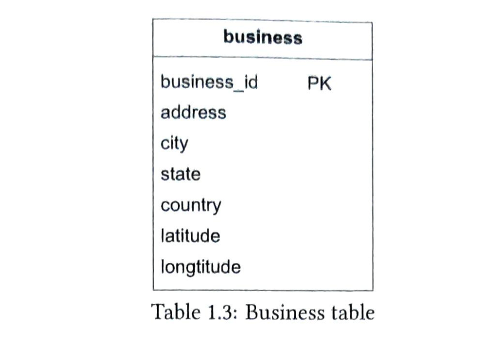  
表 1.3: 商家表

**地理索引表**  
地理索引表用于高效处理空间操作。由于该表需要一些关于geohash的知识，我们将在第24页的"扩展数据库"部分讨论它。

### 高层设计
高层设计图如图1.2所示。系统包含两个部分:基于位置的服务(LBS)和商家相关服务。让我们看看系统的每个组件。  
  
图 1.2: 高层设计

#### 负载均衡器  
负载均衡器自动在多个服务之间分配传入流量。通常，公司提供单一的DNS入口点，并根据URL路径在内部将API调用路由到适当的服务。

#### 基于位置的服务(LBS)
LBS服务是系统的核心部分，用于在给定半径和位置范围内查找附近的商家。LBS具有以下特点:
- 这是一个读取量大且没有写请求的服务。
- QPS很高，特别是在密集区域的高峰时段。
- 这个服务是无状态的，所以很容易水平扩展。

#### 商家服务
商家服务主要处理两类请求:
- 商家所有者创建、更新或删除商家。这些请求主要是写操作，QPS不高。
- 客户查看商家的详细信息。QPS在高峰时段很高。

#### 数据库集群
数据库集群可以使用主从设置。在这种设置中，主数据库处理所有写操作，多个副本用于读操作。数据首先保存到主数据库，然后复制到副本。由于复制延迟，LBS读取的数据和写入主数据库的数据之间可能存在一些差异。这种不一致性通常不是问题，因为商家信息不需要实时更新。

#### 商家服务和LBS的可扩展性
商家服务和LBS都是无状态服务，所以很容易自动添加更多服务器来应对高峰流量(如用餐时间)并在非高峰时段(如睡眠时间)移除服务器。如果系统在云上运行，我们可以设置不同的区域和可用区以进一步提高可用性[9]。我们在深入探讨中会详细讨论这一点。

#### 获取附近商家的算法
在实际应用中，公司可能使用现有的地理空间数据库，如Redis中的Geohash[10]或带PostGIS扩展的Postgres[11]。在面试中，你不需要了解这些地理空间数据库的内部原理。最好是通过解释地理空间索引的工作原理来展示你的问题解决能力和技术知识，而不是简单地列举数据库名称。

下一步是探索获取附近商家的不同选项。我们将列出几个选项，回顾思考过程，并讨论权衡。

选项1:二维搜索  
获取附近商家最直观但最简单的方法是画一个预定义半径的圆，并找出圆内的所有商家，如图1.3所示。  
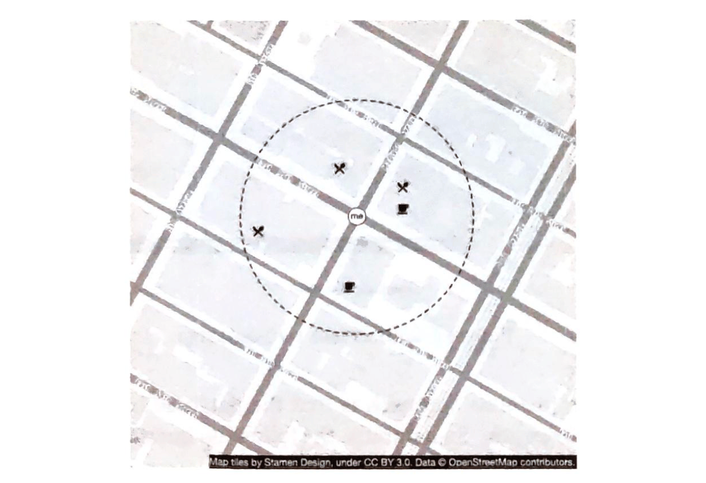  
图 1.3: 二维搜索

这个过程可以转换为以下伪SQL查询:
```sql
Select business_id, latitude, longitude FROM business
WHERE (latitude BETWEEN {:my_lat} - radius AND {:my_lat} + radius) 
AND (longitude BETWEEN {:my_long} - radius AND {:my_long} + radius)
```
这个查询效率不高，因为我们需要扫描整个表。

如果我们在经度和纬度列上建立索引呢？这会提高效率吗？答案是不会提高太多。问题在于我们有二维数据，而每个维度返回的数据集可能仍然很大。例如，如图1.4所示，由于经度和纬度列上的索引，我们可以快速检索数据集1和数据集2。但要获取半径内的商家，我们需要对这两个数据集执行交集操作。这不够高效，因为每个数据集都包含大量数据。  
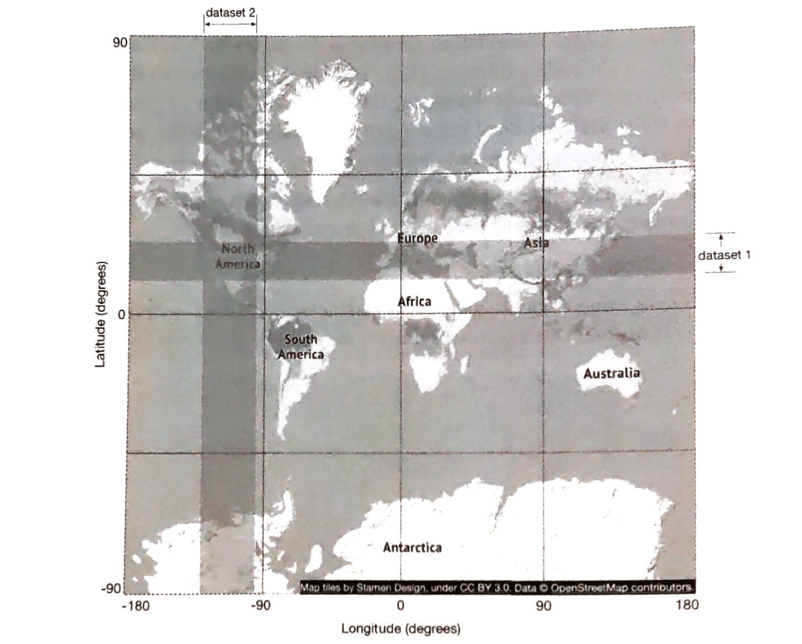  
图 1.4: 两个数据集的交集

前面方法的问题在于数据库索引只能提高一个维度的搜索速度。所以自然而然的后续问题是，我们能否将二维数据映射到一维？答案是肯定的。

在深入研究答案之前，让我们看看不同类型的索引方法。

从广义上讲，有两种类型的地理空间索引方法，如图1.5所示。我们详细讨论高亮显示的算法，因为它们在业界常用。

- Hash: 均匀网格、geohash、笛卡尔层[12]等。
- Tree: 四叉树、Google S2、R树[13]等。  
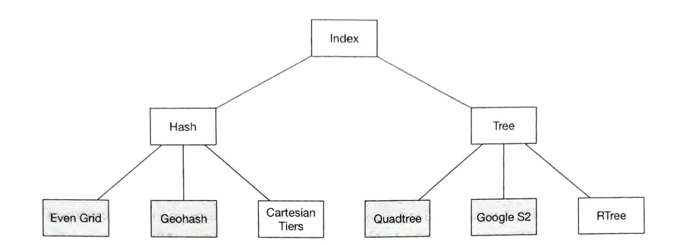  
图 1.5: 不同类型的地理空间索引

尽管这些方法的底层实现不同，但高层思想是相同的，**即将地图划分为更小的区域，并建立索引以便快速搜索**。其中，geohash、四叉树和Google S2在实际应用中最为广泛使用。让我们逐一看看它们。

**提醒**  
在实际面试中，你通常不需要解释索引选项的实现细节。但是，了解地理空间索引的需求、其高层工作原理以及局限性是很重要的。

选项2:均匀划分网格  
一种简单的方法是将世界均匀划分为小网格(图1.6)。这样，一个网格可以包含多个商家，地图上的每个商家都属于一个网格。  
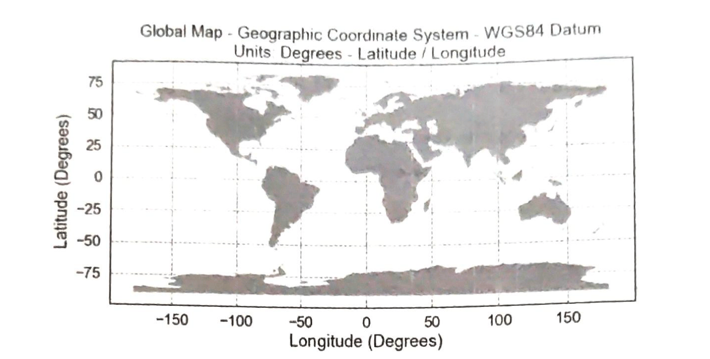  
图 1.6: 全球地图(来源:[14])

这种方法在某种程度上有效，但有一个主要问题:商家的分布不均匀。纽约市中心可能有很多商家，而沙漠或海洋中的其他网格可能根本没有商家。通过将世界划分为均匀网格，我们产生了非常不均匀的数据分布。理想情况下，我们希望在密集区域使用更细粒度的网格，在稀疏区域使用大网格。另一个潜在的挑战是找到固定网格的相邻网格。

选项3:Geohash  
Geohash比均匀划分网格选项更好。它通过将二维经纬度数据减少为一维字母和数字字符串来工作。Geohash算法通过递归地将世界划分为越来越小的网格来工作，每增加一位就划分一次。让我们从高层次了解geohash是如何工作的。

首先，沿着本初子午线和赤道将地球分为四个象限。  
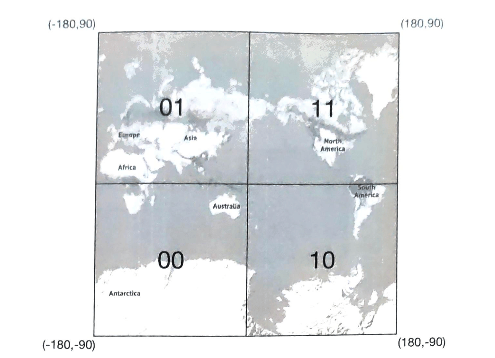  
图 1.7: Geohash

- 纬度范围(-90， 0]用0表示
- 纬度范围[0， 90]用1表示
- 经度范围(-180， 0]用0表示
- 经度范围[0， 180]用1表示

第二步，将每个网格分为四个更小的网格。每个网格可以通过交替使用经度位和纬度位来表示。
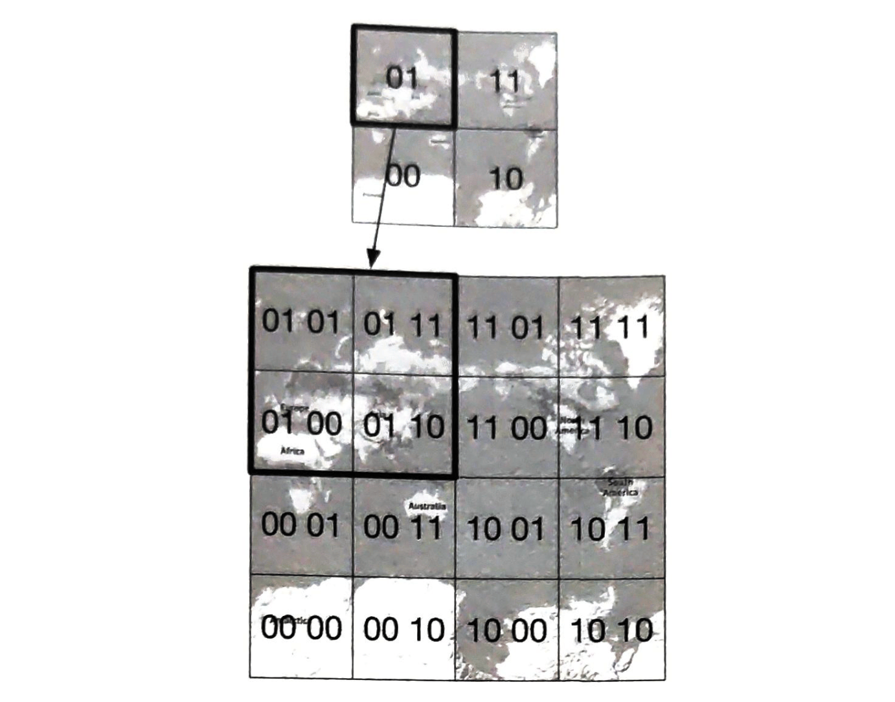
图 1.8: 划分网格

重复这个细分过程，直到网格大小达到所需的精度。Geohash通常使用base32表示[15]。让我们看两个例子。
- Google总部的geohash(长度=6):  
1001 10110 01001 10000 11011 11010(二进制的base32) -> 9q9hvu(base32)
- Facebook总部的geohash(长度=6):  
1001 10110 01001 10001 10000 10111(二进制的base32) -> 9q9jhr(base32)

Geohash有12个精度(也称为级别)，如表1.4所示。精度因子决定了网格的大小。我们只对长度在4到6之间的geohash感兴趣。这是因为当长度超过6时，网格太小，而当长度小于4时，网格太大(见表1.4)。  
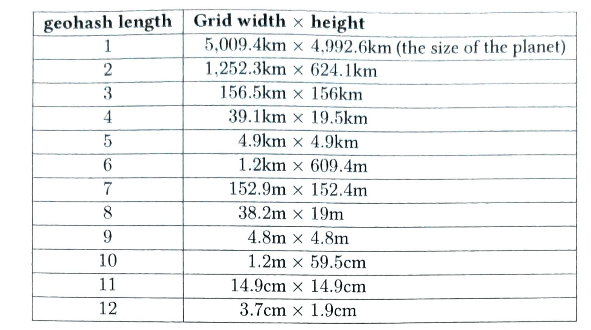  
表 1.4: Geohash长度到网格大小的映射(来源:[16])

我们如何选择正确的精度？我们想要找到能覆盖用户定义半径画出的整个圆的最小geohash长度。半径和geohash长度之间的对应关系如下表所示。  
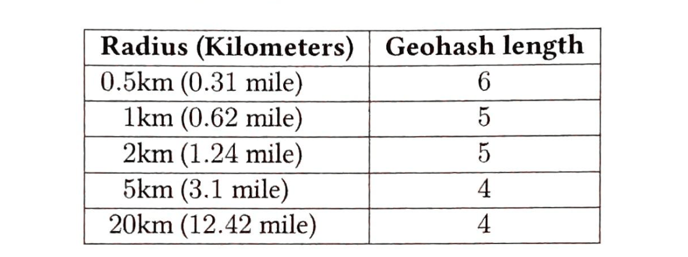  
表 1.5: 半径到geohash的映射

这种方法在大多数情况下都很好用，但我们应该与面试官讨论一下geohash边界处理的一些边缘情况。

#### 边界问题
Geohash保证两个geohash之间共享的前缀越长，它们就越接近。如图1.9所示，所有网格都有一个共享前缀:9q8zn。  
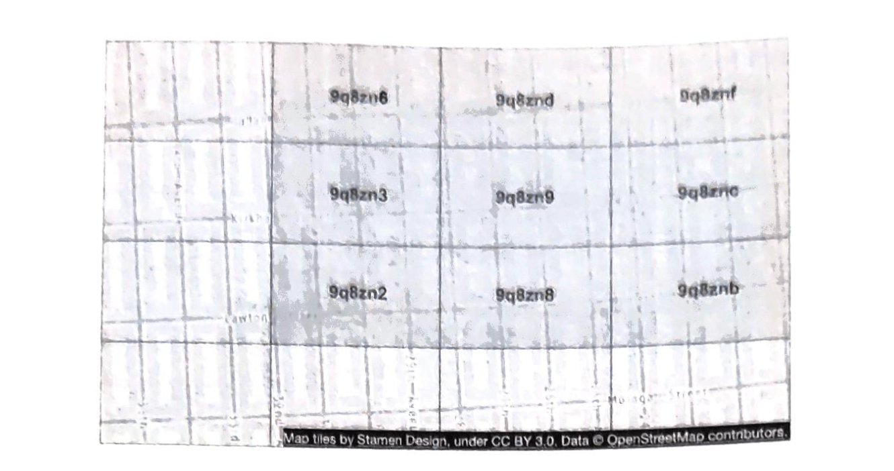  
图 1.9: 共享前缀

#### 边界问题1
然而，反过来并不成立:两个位置可能很接近但完全没有共享前缀。这是因为位于赤道或本初子午线两侧的两个接近位置属于世界的不同"半边"。例如，在法国，La Roche-Chalais(geohash: U08)距离Pomerol(geohash: ezzz)只有30公里，但它们的geohash完全没有共享前缀[17]。  
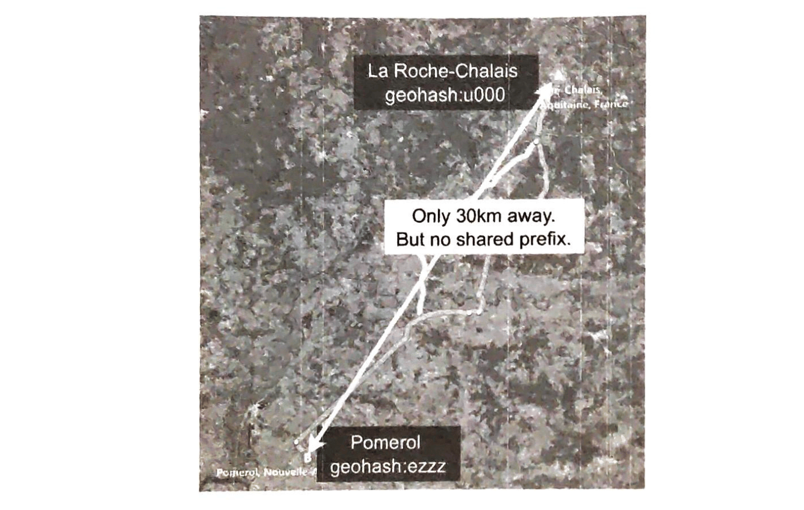  
图 1.10: 没有共享前缀

由于这个边界问题，下面这个简单的前缀SQL查询将无法获取所有附近的商家。

```sql
SELECT * FROM geohash_index WHERE geohash LIKE '9q8zn%'
```

#### 边界问题2
另一个边界问题是两个位置可能有很长的共享前缀，但它们属于不同的geohash，如图1.11所示。  
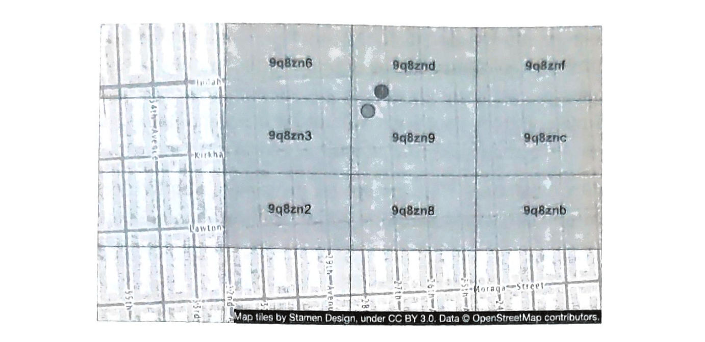  
图 1.11: 边界问题

一个常见的解决方案是不仅获取当前网格内的所有商家，还要获取其邻居网格中的商家。邻居的geohash可以在常数时间内计算出来，更多细节可以在这里找到[17]。

#### 商家不足
现在让我们解决额外的问题。如果当前网格和所有邻居网格中的商家加起来不够怎么办？

选项1:只返回半径内的商家。  
这个选项容易实现，但缺点很明显。它不能返回足够的结果来满足用户的需求。

选项2:增加搜索半径。  
我们可以删除geohash的最后一位数字，并使用新的geohash来获取附近的商家。如果商家数量不够，我们继续通过删除另一位数字来扩大范围。这样，网格大小会逐渐扩大，直到结果数量超过所需数量。图1.12显示了扩展搜索过程的概念图。  
  
图 1.12: 扩展搜索过程

选项4:四叉树  
另一个流行的解决方案是四叉树。四叉树[18]是一种数据结构，通常用于通过递归地将二维空间划分为四个象限(网格)来对其进行分区，直到网格的内容满足某些标准。

例如，标准可以是继续细分直到网格中的商家数量不超过100。这个数字是任意的，实际数字可以根据业务需求来确定。使用四叉树，我们在内存中构建一个树结构来回答查询。请注意，四叉树是一个内存数据结构，而不是数据库解决方案。它在每个LBS服务器上运行，数据结构在服务器启动时构建。

下图展示了将世界划分为四叉树的概念过程。让我们假设世界包含2亿个商家。  
  
图 1.13: 四叉树

图1.14更详细地解释了四叉树的构建过程。根节点代表整个世界地图。根节点被递归地分解为4个象限，直到没有节点包含超过100个商家。  
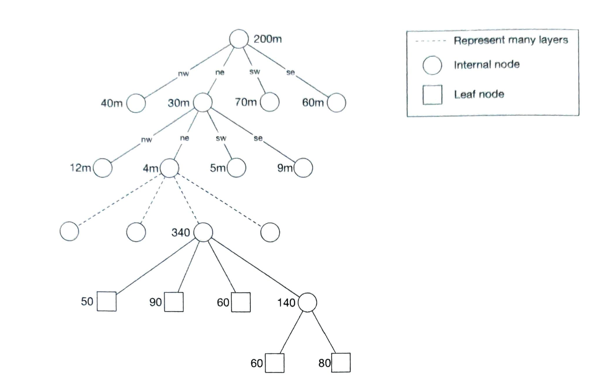  
图 1.14: 构建四叉树

构建四叉树的伪代码如下所示:

```java
public void buildQuadtree(TreeNode node) {
    if (countNumberOfBusinessesInCurrentGrid(node) > 100) {
        node.subdivide();
        for (TreeNode child : node.getChildren()) {
            buildQuadtree(child);
        }
    }
}
```

#### 存储整个四叉树需要多少内存？
要回答这个问题，我们需要知道存储什么样的数据。

#### 叶子节点上的数据
  
表 1.6: 叶子节点

内部节点上的数据  
  
表 1.7: 内部节点

尽管树的构建过程取决于网格内的商家数量，但这个数字不需要存储在四叉树节点中，因为它可以从数据库中的记录推断出来。

现在我们知道了每个节点的数据结构，让我们看看内存使用情况。
- 每个网格最多可以存储100个商家
- 叶子节点数量 = ~2亿/100 = ~200万
- 内部节点数量 = 200万×1/3 = ~67万。如果你不知道为什么内部节点数量是叶子节点数量的三分之一，请阅读参考资料[19]
- 总内存需求 = 200万×832字节 + 67万×64字节 = ~1.71GB。即使我们添加一些构建树的开销，构建树的内存需求也相当小。

在实际面试中，我们不需要这么详细的计算。这里的关键点是四叉树索引不会占用太多内存，可以轻松地放在一台服务器上。

这是否意味着我们应该只使用一台服务器来存储四叉树索引？答案是否定的。根据读取量，单个四叉树服务器可能没有足够的CPU或网络带宽来服务所有读取请求。如果是这种情况，就有必要在多个四叉树服务器之间分散读取负载。

#### 构建整个四叉树需要多长时间？
每个叶子节点包含大约100个商家ID。构建树的时间复杂度是 $\frac{n}{100}$ log $\frac{n}{100}$ ，其中n是商家总数。对于2亿个商家，可能需要几分钟来构建整个四叉树。

#### 如何使用四叉树获取附近的商家？
1. 在内存中构建四叉树。
2. 四叉树构建完成后，从根开始搜索并遍历树，直到找到包含搜索原点的叶子节点。如果该叶子节点有100个商家，返回该节点。否则，从其邻居那里添加商家，直到返回足够的商家。

四叉树的操作考虑
如上所述，对于2亿个商家，在服务器启动时构建四叉树可能需要几分钟。考虑这么长的服务器启动时间的操作影响很重要。在四叉树构建期间，服务器无法处理流量。因此，我们应该逐步地将新版本的服务器发布到服务器的一小部分子集。这避免了使服务器集群的大部分离线并导致服务中断。蓝/绿部署[20]也可以使用，但整个新服务器集群同时从数据库服务获取2亿个商家可能会给系统带来很大压力。这是可以做到的，但可能会使设计变得复杂，你应该在面试中提到这一点。

另一个操作考虑是随着时间的推移，商家被添加和删除时如何更新四叉树。最简单的方法是在整个集群中逐步重建四叉树，每次只重建一小部分服务器。但这意味着一些服务器在短时间内会返回过时的数据。然而，根据需求，这通常是一个可以接受的折折中方案。这可以通过设置业务协议来进一步缓解，即新添加/更新的商家将在第二天生效。这意味着我们可以使用夜间作业来更新缓存。这种方法的一个潜在问题是大量的键会在同一时间失效，导致缓存服务器负载过重。

也可以在商家添加和删除时动态更新四叉树。这当然会使设计变得更复杂，特别是如果四叉树数据结构可能被多个线程访问。这将需要一些锁定机制，这可能会大大复杂化四叉树的实现。

#### 四叉树的实际例子
Yext[21]提供了一张图片(图1.15)，显示了在丹佛附近构建的四叉树[21]。我们希望在密集区域使用更小、更细粒度的网格，在稀疏区域使用更大的网格。  
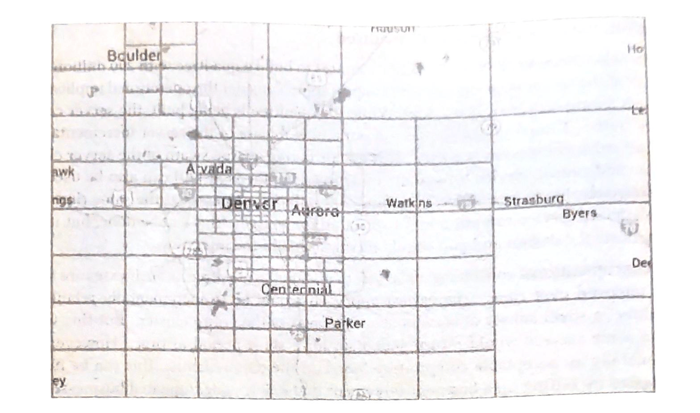  
图 1.15: 四叉树的实际例子

选项5:Google S2  
Google S2几何库[22]是该领域的另一个重要参与者。与四叉树类似，它是一个内存解决方案。它基于希尔伯特曲线(一种空间填充曲线)[23]将球体映射到1D索引。希尔伯特曲线有一个非常重要的特性:在希尔伯特曲线上彼此接近的两个点在1D空间中也是接近的(图1.16)。在1D空间上的搜索比在2D空间上的搜索效率要高得多。感兴趣的读者可以使用在线工具[24]来体验希尔伯特曲线。  
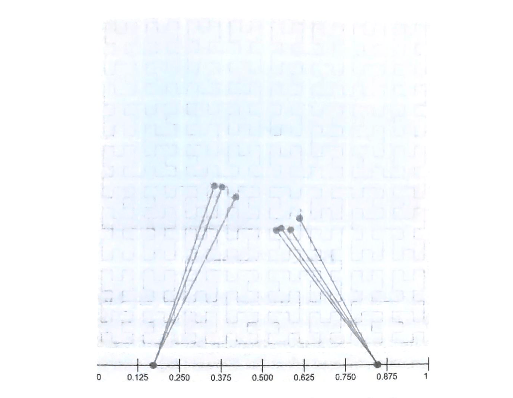  
图 1.16: 希尔伯特曲线(来源:[24])

S2是一个复杂的库，在面试中你不需要解释其内部原理。但是因为它在Google、Tinder等公司广泛使用，我们将简要介绍它的优势。
- S2非常适合地理围栏，因为它可以用不同级别覆盖任意区域(图1.17)。根据维基百科，"地理围栏是真实地理区域的虚拟边界。地理围栏可以动态生成-例如以点位置为中心的半径，或者地理围栏可以是预定义的边界集合(如学校区域或邻里边界)"[25]。
地理围栏允许我们定义围绕感兴趣区域的边界，并向离开区域的用户发送通知。这可以提供比仅返回附近商家更丰富的功能。  
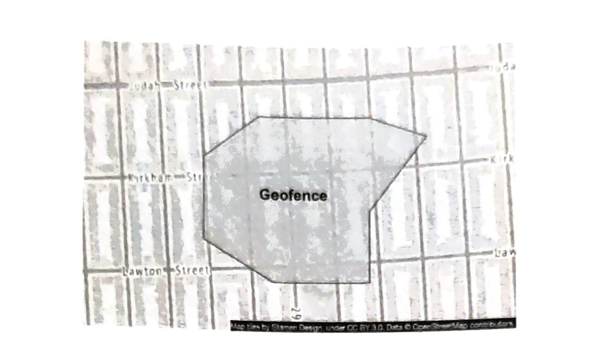  
图 1.17: 地理围栏

- S2的另一个优势是其区域覆盖算法[26]。与geohash中的固定级别(精度)不同，在S2中我们可以指定最小级别、最大级别和最大单元格数。由于单元格大小是灵活的，S2返回的结果更加精细。如果你想了解更多，可以看看S2工具[26]。

建议
为了高效地查找附近的商家，我们讨论了几个选项:geohash、四叉树和S2。如表1.8所示，不同的公司或技术采用不同的选项。  
  
表 1.8: 不同类型的地理索引

在面试中，我们建议选择geohash或四叉树，因为S2太复杂，在面试中很难清楚地解释。

Geohash vs 四叉树
在结束本节之前，让我们快速比较一下geohash和四叉树。

Geohash
- 使用和实现都很简单。不需要构建树。
- 支持返回指定半径内的商家。
- 当geohash的精度(级别)固定时，网格大小也是固定的。它不能根据人口密度动态调整网格大小。需要更复杂的逻辑来支持这一点。
- 更新索引很容易。例如，要从索引中删除一个商家，我们只需要从具有相同geohash和business_id的对应行中删除它。见图1.18的具体示例。  
  
图 1.18: 删除商家

四叉树
- 由于需要构建树，实现稍微复杂一些。
- 支持获取k个最近的商家。有时我们只想返回k个最近的商家，不关心商家是否在指定半径内。例如，当你在旅行时汽车油量不足，你只想找到最近的加油站。这些加油站可能离你不近，但应用程序需要返回最近的k个结果。对于这类查询，四叉树是一个很好的选择，因为它的细分过程是基于数量的，它可以自动调整查询范围直到返回k个结果。
- 它可以根据人口密度动态调整网格大小(见图1.15中的丹佛示例)。
- 更新索引比geohash更复杂。四叉树是一个树结构。如果要删除一个商家，我们需要从根节点遍历到叶子节点来删除该商家。例如，如果我们想删除ID=2的商家，我们必须从根节点一直遍历到叶子节点，如图1.19所示。更新索引的时间复杂度是O(log n)，但如果数据结构被多线程程序访问，实现会变得复杂，因为需要锁定。此外，重新平衡树也可能很复杂。例如，当叶子节点没有空间容纳新添加的商家时，就需要重新平衡。一个可能的解决方案是过度分配范围。  
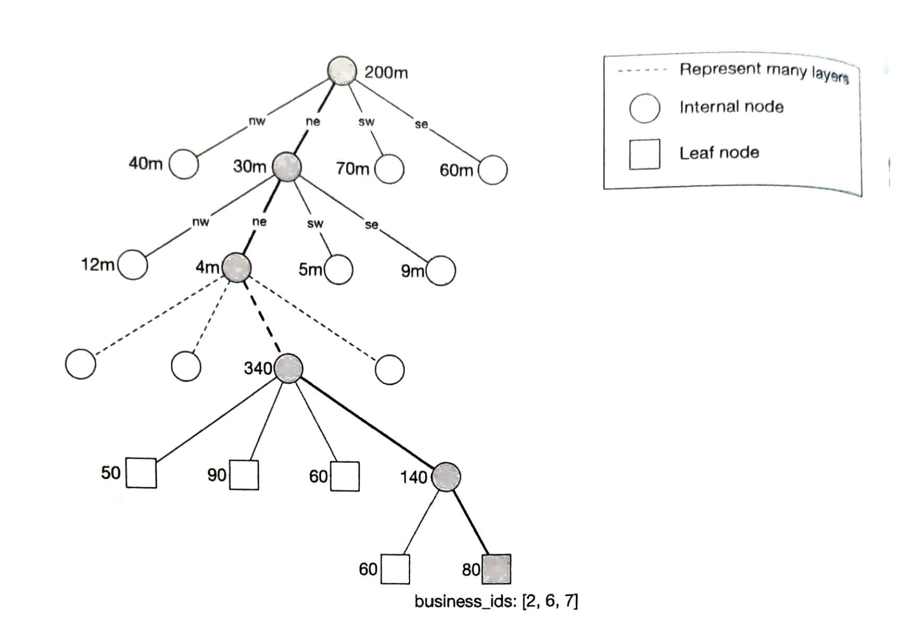  
图 1.19: 更新四叉树

## 第3步 - 深入设计

到目前为止，你应该对整个系统有了很好的了解。现在让我们深入研究几个领域:
- 扩展数据库
- 缓存
- 区域和可用区
- 按时间或商家类型过滤结果
- 最终架构图

### 扩展数据库
我们将讨论如何扩展两个最重要的表:商家表和地理空间索引表。

商家表  
商家表的数据可能无法全部放在一台服务器上，所以它是分片的好候选。最简单的方法是按business_id分片。这种分片方案确保负载在所有分片之间均匀分布，并且在运维上很容易维护。

地理空间索引表  
Geohash和四叉树都被广泛使用。由于geohash的简单性，我们用它作为示例。有两种方式来构建表。

选项1:对于每个geohash键，在单行中有一个business_id的JSON数组。这意味着一个geohash内的所有business_id都存储在一行中。

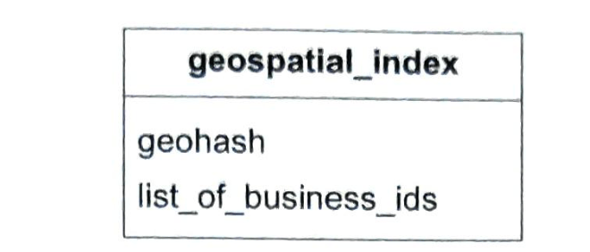  
表 1.9: list_of_business_ids是一个JSON数组

选项2:如果同一个geohash中有多个商家，将有多行，每个商家一行。这意味着一个geohash内的不同business_id存储在不同的行中。

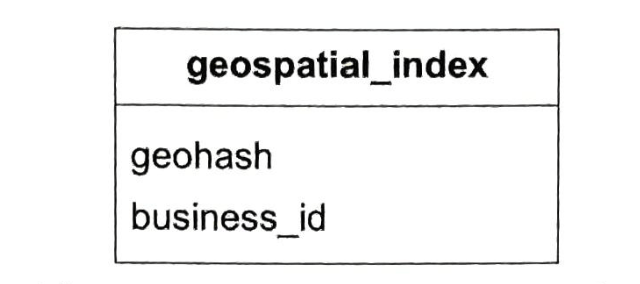  
表 1.10: business_id是单个ID

以下是选项2的一些示例行。  
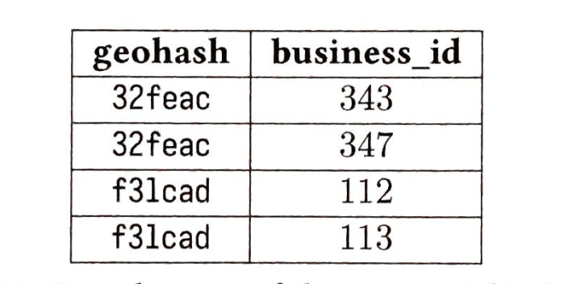  
表 1.11: 地理空间索引表的示例行

建议:我们推荐选项2，原因如下:
对于选项1，要更新一个商家，我们需要获取business_id数组并扫描整个数组来找到要更新的商家。插入新商家时，我们必须扫描整个数组以确保没有重复。我们还需要锁定该行以防止并发更新。有很多边缘情况需要处理。
对于选项2，如果我们有两列组成的复合键(geohash， business_id)，添加和删除商家就非常简单。不需要锁定任何内容。

扩展地理空间索引  
关于扩展地理空间索引的一个常见错误是在考虑表的实际数据大小之前就急于采用分片方案。在我们的案例中，地理空间索引表的完整数据集并不大(四叉树索引只需要1.71G内存，geohash索引的存储需求类似)。整个地理空间索引可以轻松地放入现代数据库服务器的工作集中。然而，根据读取量，单个数据库服务器可能没有足够的CPU或网络带宽来处理所有读取请求。如果是这种情况，就有必要在多个数据库服务器之间分散读取负载。

有两种通用方法来分散关系数据库服务器的负载。我们可以添加读副本，或者对数据库进行分片。

许多工程师喜欢在面试中谈论分片。然而，对于geohash表来说，这可能不是一个好选择，因为分片很复杂。例如，分片逻辑必须添加到应用层。有时，分片是唯一的选择。但在这种情况下，所有内容都可以放入数据库服务器的工作集中，所以没有强有力的技术理由在多个服务器之间分片数据。

在这种情况下，更好的方法是使用一系列读副本来帮助处理读取负载。这种方法在开发和维护上要简单得多。因此，建议通过副本来扩展地理空间索引表。

### 缓存
在引入缓存层之前，我们必须问自己，我们真的需要缓存层吗？

缓存是否有明显的优势并不明显:
- 工作负载是读取密集型的，数据集相对较小。数据可以放入任何现代数据库服务器的工作集中。因此，查询不受I/O限制，它们的运行速度应该几乎和内存缓存一样快。
- 如果读取性能成为瓶颈，我们可以添加数据库读副本来提高读取吞吐量。

在与面试官讨论缓存时要谨慎，因为它需要仔细的基准测试和成本分析。如果你发现缓存确实符合业务需求，那么你可以继续讨论缓存策略。

缓存键  
最直接的缓存键选择是用户的位置坐标(纬度和经度)。然而，这种选择有几个问题:
- 手机返回的位置坐标并不准确，因为它们只是最佳估计[32]。即使你不移动，每次在手机上获取坐标时结果可能也略有不同。
- 用户可以从一个位置移动到另一个位置，导致位置坐标略有变化。对于大多数应用来说，这种变化并不重要。

因此，位置坐标不是一个好的缓存键。理想情况下，位置的小变化应该仍然映射到相同的缓存键。前面提到的geohash/四叉树解决方案很好地处理了这个问题，因为一个网格内的所有商家都映射到相同的geohash。

要缓存的数据类型  
如表1.12所示，有两种类型的数据可以缓存以提高系统的整体性能:  
  
表 1.12: 缓存中的键值对

网格中的商家ID列表  
由于商家数据相对稳定，我们预先计算给定geohash的商家ID列表并将其存储在Redis等键值存储中。让我们看一个启用缓存获取附近商家的具体示例。

1. 获取给定geohash的商家ID列表。
SELECT business_id FROM geohash_index WHERE geohash LIKE '{geohash}%'

2. 如果缓存未命中，将结果存储在Redis缓存中。
```java
public List<String> getNearbyBusinessIds(String geohash) {
    String cacheKey = hash(geohash);
    List<String> listOfBusinessIds = Redis.get(cacheKey);
    if (listOfBusinessIds == null) {
        listOfBusinessIds = Run the select SQL query above;
        Cache.set(cacheKey， listOfBusinessIds， "1d");
    }
    return listOfBusinessIds;
}
```

当添加、编辑或删除新商家时，数据库会更新并使缓存失效。由于这些操作的数量相对较小，并且geohash方法不需要锁定机制，更新操作很容易处理。

根据需求，用户可以在客户端选择以下4个半径:500m、1km、2km和5km。这些半径分别映射到长度为4、5、5和6的geohash。为了快速获取不同半径的附近商家，我们在Redis中缓存所有三个精度(geohash_4、geohash_5和geohash_6)的数据。

如前所述，我们有2亿个商家，每个商家在给定精度下属于1个网格。因此所需的总内存是:
- Redis值的存储:8字节×2亿×3个精度 = ~5GB
- Redis键的存储:可以忽略不计
- 所需总内存:~5GB

从内存使用的角度来看，我们可以使用一台现代Redis服务器，但为了确保高可用性并减少跨大洲的延迟，我们在全球部署Redis集群。考虑到估计的数据大小，我们可以在全球部署相同的缓存数据副本。我们在最终架构图(图1.21)中将这个Redis缓存称为"Geohash"。

渲染客户端页面所需的商家数据
这种类型的数据缓存非常直接。键是business_id，值是包含商家名称、地址、图片URL等的商家对象。我们在最终架构图(图1.21)中将这个Redis缓存称为"Business info"。

区域和可用区  
我们将基于位置的服务部署到多个区域和可用区，如图1.20所示。这有几个优点:
- 使用户在物理上"更接近"系统。美国西部的用户连接到该区域的数据中心，欧洲的用户连接到欧洲的数据中心。
- 让我们能够根据人口灵活地均匀分散流量。日本和韩国等一些地区人口密度高。将它们放在单独的区域，或者甚至在多个可用区部署基于位置的服务来分散负载可能是明智的。
- 隐私法律。某些国家可能要求用户数据在本地使用和存储。在这种情况下，我们可以在该国设置一个区域，并使用DNS路由将该国的所有请求限制在该区域内。  
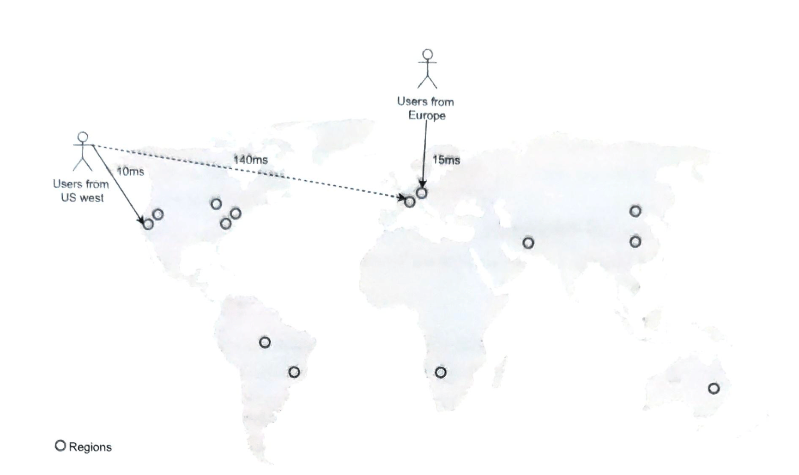  
图 1.20: 将LBS部署"更接近"用户

后续问题:按时间或商家类型过滤结果  
面试官可能会问一个后续问题:如何返回现在营业的商家，或者只返回餐厅类型的商家？

候选人:当世界用geohash或四叉树划分为小网格时，搜索结果返回的商家数量相对较少。因此，先返回商家ID，然后填充商家对象，并根据营业时间或商家类型进行过滤是可以接受的。这个解决方案假设营业时间和商家类型存储在商家表中。

### 最终设计图
把所有内容放在一起，我们得到以下设计图。  
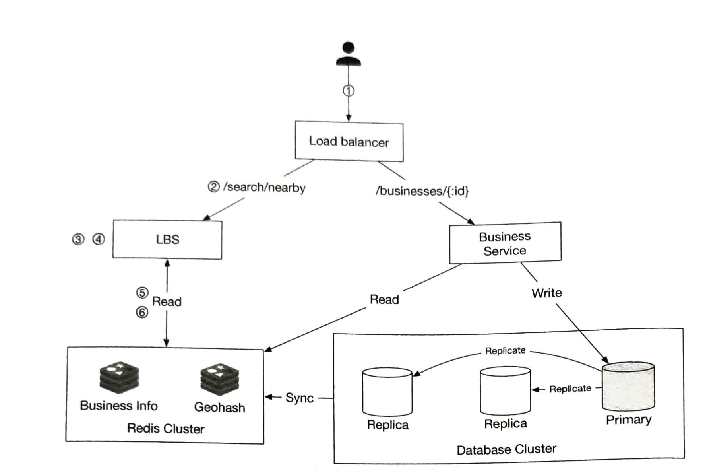  
图 1.21: 设计图

获取附近商家  
1. 你在Yelp上尝试查找500米范围内的餐厅。客户端将用户位置(纬度=37.776720，经度=-122.416730)和半径(500m)发送到负载均衡器。
2. 负载均衡器将请求转发到LBS。
3. 基于用户位置和半径信息，LBS找到匹配搜索的geohash长度。通过查看表1.5，500m对应geohash长度=6。
4. LBS计算相邻的geohash并将它们添加到列表中。结果看起来像这样:
list_of_geohashes = [my_geohash， neighbor1_geohash， neighbor2_geohash， ...， neighbor8_geohash]。
5. 对于list_of_geohashes中的每个geohash，LBS调用"Geohash" Redis服务器来获取相应的商家ID。获取每个geohash的商家ID的调用可以并行进行以减少延迟。
6. 基于返回的商家ID列表，LBS从"Business info" Redis服务器获取完整的商家信息，然后计算用户和商家之间的距离，对它们进行排序，并将结果返回给客户端。

查看、更新、添加或删除商家  
所有与商家相关的API都与LBS分开。要查看商家的详细信息，商家服务首先检查数据是否存储在"Business info" Redis缓存中。如果是，将返回缓存的数据给客户端。如果不是，从数据库集群获取数据并存储在Redis缓存中，允许后续请求直接从缓存获取结果。

由于我们有一个预先的业务协议，新添加/更新的商家将在第二天生效，缓存的商家数据由夜间作业更新。

## 第4步 - 总结
在本章中，我们介绍了附近地点服务的设计。该系统是一个典型的利用地理空间索引的LBS。我们讨论了几个索引选项:
- 二维搜索
- 均匀划分网格
- Geohash
- 四叉树
- Google S2

Geohash、四叉树和S2被不同的科技公司广泛使用。我们选择geohash作为示例来展示地理空间索引是如何工作的。

在深入探讨中，我们讨论了为什么缓存在减少延迟方面是有效的，应该缓存什么以及如何使用缓存快速检索附近的商家。我们还讨论了如何通过复制和分片来扩展数据库。

然后我们研究了在不同区域和可用区部署LBS，以提高可用性，使用户在物理上更接近服务器，并更好地遵守当地隐私法律。

恭喜你走到这里!现在给自己一个鼓励。干得好!

章节总结  
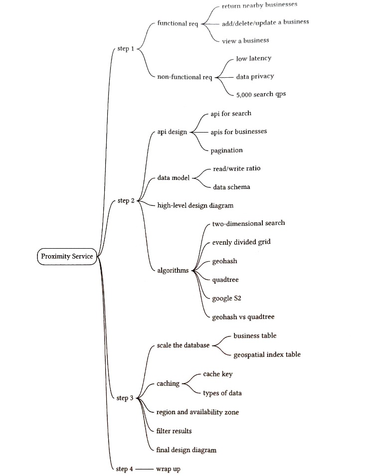


## 参考资料
[1] Yelp. https://www.yelp.com/  
[2] Map tiles by Stamen Design. http://maps.stamen.com/  
[3] OpenStreetMap. https://www.openstreetmap.org  
[4] GDPR. https://en.wikipedia.org/wiki/General_Data_Protection_Regulation  
[5] CCPA. https://en.wikipedia.org/wiki/California_Consumer_Privacy_Act  
[6] REST API中的分页. https://developer.atlassian.com/server/confluence/  pagination-in-the-rest-api/  
[7] Google places API. https://developers.google.com/maps/documentation/places/web-service/search  
[8] Yelp商家端点. https://www.yelp.com/developers/documentation/v3/business_search  
[9] 区域和可用区. https://docs.aws.amazon.com/AWSEC2/latest/UserGuide/using-regions-availability-zones.html  
[10] Redis GEOHASH. https://redis.io/commands/GEOHASH  
[11] POSTGIS. https://postgis.net/  
[12] 笛卡尔层. http://www.nsshutdown.com/projects/lucene/whitepaper/locallucene_v2.html  
[13] R-tree. https://en.wikipedia.org/wiki/R-tree  
[14] 地理坐标参考系统中的全球地图. https://bit.ly/3DsjAwg  
[15] Base32. https://en.wikipedia.org/wiki/Base32  
[16] Geohash网格聚合. https://bit.ly/3kK146  
[17] Geohash. https://www.movable-type.co.uk/scripts/geohash.html  
[18] 四叉树. https://en.wikipedia.org/wiki/Quadtree  
[19] 四叉树有多少叶子. https://stackoverflow.com/questions/35976444/how-many-leaves-has-a-quadtree  
[20] 蓝绿部署. https://martinfowler.com/bliki/BlueGreenDeployment.html  
[21] 使用四叉树改进位置缓存. https://engblog.yext.com/post/geolocation-caching  
[22] S2. https://s2geometry.io/  
[23] 希尔伯特曲线. https://en.wikipedia.org/wiki/Hilbert_curve  
[24] 希尔伯特映射. http://bit-player.org/extras/hilbert/hilbert-mapping.html  
[25] 地理围栏. https://en.wikipedia.org/wiki/Geo-fence  
[26] 区域覆盖. https://s2.sidewalklabs.com/regioncoverer/  
[27] Bing地图. https://bit.ly/30ytSfG  
[28] MongoDB. https://docs.mongodb.com/manual/tutorial/build-a-2d-index/  
[29] 地理空间索引:支持Lyft的每秒1000万QPS的Redis架构. https://www.youtube.com/watch?v=cSFWIF96Sds&t=2155s  
[30] 地理形状类型. https://www.elastic.co/guide/en/elasticsearch/reference/1.6/mapping-geo-shape-type.html  
[31] 地理分片推荐第1部分:分片方法. https://medium.com/tinder-engineering/geosharded-recommendations-part-1-sharding-approach-d5d540ec77a  
[32] 获取最后已知位置. https://developer.android.com/training/location/retrieve-current#Challenges  